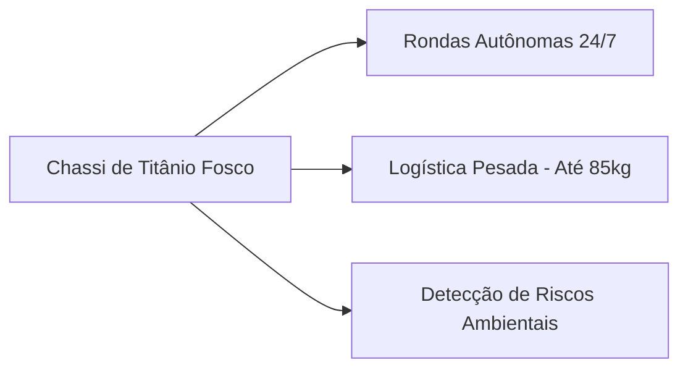
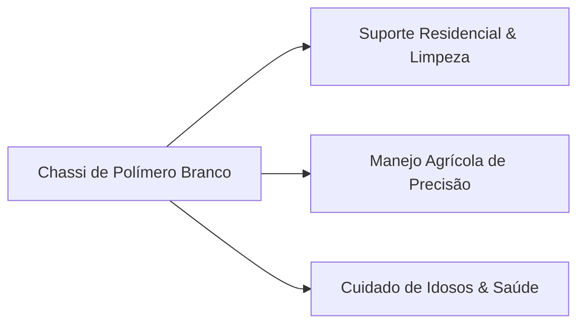

# 🤖 ZettaTech — Especificações e Diretrizes de Portfólio de Protótipos

Este documento define de forma definitiva as capacidades técnicas, objetivos funcionais, segmentação comercial e estratégias de precificação das duas plataformas de robôs humanoides da **ZettaTech**: o **Zetta Atlas** (Segmento Industrial B2B) e o **Zetta Gaia** (Segmento Doméstico/Agro B2C).

---

## 💡 Visão de Design e Filosofia Autônoma

Ambas as plataformas foram concebidas sob a diretriz de **Cognição Prática e Aprendizado Empírico**. Em vez de programar linhas de código rígidas para tarefas específicas, a inteligência central da ZettaTech permite que os robôs se adaptem de forma fluida a qualquer cenário.

### 🧠 Core Cognitivo Compartilhado

Independentemente do modelo de chassi, todos os humanoides Zetta integram os seguintes pilares de inteligência e percepção:

1. **Learning by Demonstration (LbD - Aprendizado por Demonstração):**
   * **O que é:** Capacidade de aprender qualquer tarefa física complexa simplesmente observando um operador humano realizá-la uma única vez.
   * **Exemplo Prático (Abertura de Portas / Manuseio):** O robô não apenas filma a ação; o sistema óptico e de mapeamento neural rastreia a aceleração, a biomecânica articular, o vetor de força necessário para girar a maçaneta, e calcula dinamicamente o torque necessário em seus próprios atuadores. O robô aprende o passo a passo exato do movimento e se adapta à resistência física da porta.
   * **Aprendizado Linguístico Dinâmico:** Os robôs são equipados com um núcleo de processamento de linguagem neural que permite aprender, interpretar e falar qualquer idioma fluentemente em tempo real através da interação social e auditiva.

2. **Percepção Trans-Estrutural (Visão Atrás de Portas e Barreiras):**
   * **Tecnologia:** Fusão de sensores baseada em **Radar de Ondas Milimétricas (mmWave)**, **Câmeras Térmicas de Longo Alcance** e **Geometria LiDAR ativa**.
   * **Capacidade:** Os robôs conseguem mapear layouts estruturais ocultos, identificar assinaturas térmicas humanas ou animais e detectar obstáculos em movimento mesmo atrás de portas fechadas ou paredes divisórias leves. Isso previne colisões antes mesmo de entrar em uma nova sala.

3. **Mapeamento e Detecção de Ameaças Ambientais:**
   * **Sensores Químicos / Olfato Digital:** Nariz eletrônico de alta fidelidade capaz de identificar vazamentos de gases (GLP, metano, monóxido de carbono, vapores químicos industriais) e vazamentos microscópicos de água ou fluidos refrigerantes.
   * **Sensor de Radiação Ionizante:** Contador Geiger-LiDAR embutido para monitorar constantemente partículas Alfa, Beta e Gama no ar, gerando alertas instantâneos de contaminação radioativa com mapeamento 3D da nuvem de dispersão.

---

## 🏭 Zetta Atlas — Plataforma Industrial & Logística (B2B)

O **Zetta Atlas** é o trabalhador incansável da linha de frente industrial. Projetado para suportar condições de trabalho severas e cargas extremas de esforço físico, mantendo máxima precisão métrica.

### 📋 Ficha Técnica & Características Físicas
* **Altura:** 1.95 m (maior presença física para alcance industrial).
* **Carga Máxima de Manipulação:** 85 kg (capacidade de carregar fardos pesados continuamente).
* **Material do Chassi:** Chassi blindado em liga de **Titânio Fosco de Grau Aeroespacial** com juntas reforçadas e blindagem IP67 contra poeira e jatos de água de alta pressão.
* **Autonomia de Bateria:** Até 18 horas de operação contínua com sistema de recarga rápida por indução (100% em 45 minutos) ou troca a quente (*hot-swap*) de células de energia.

### 🛠️ Funções Principais e Aplicações
* **Logística e Armazenagem:** Paletização, movimentação de caixas pesadas, organização de almoxarifados inteligentes e controle de inventário por leitura RFID óptica integrada.
* **Rondas de Segurança 24/7:** Monitoramento perimetral em áreas críticas, varreduras térmicas noturnas e identificação de invasores com emissão de alertas integrados.
* **Segurança e Inspeção Ambiental:** Varredura proativa por vazamento de gases industriais, monitoramento de radiação em usinas ou depósitos de resíduos químicos e prevenção de incêndios por assinatura de calor volumétrica.
* **Manufatura Assistida:** Operação de ferramentas de torque pesado, soldagem colaborativa de alta precisão e montagem de componentes estruturais.

### 💰 Estrutura de Comercialização e Precificação
> [!IMPORTANT]
> A precificação do Zetta Atlas reflete sua blindagem de alto custo e alta capacidade produtiva, sendo posicionado como um ativo de alta rentabilidade (ROI) para indústrias.

* **Compra Direta:** **R$ 1.200.000,00** (Inclui 3 anos de garantia integral de hardware e licença vitalícia da API ZettaHub).
* **RaaS (Robot-as-a-Service / Assinatura Mensal):** **R$ 22.500,00 / mês** (Contrato mínimo de 12 meses. Inclui manutenção preventiva inclusa, substituição imediata em caso de falha e atualizações de software em nuvem inclusas).

---

## 🏡 Zetta Gaia — Plataforma Doméstica, Cuidados & Agroecologia (B2C)

A **Zetta Gaia** é a expressão máxima de suavidade, empatia e versatilidade. Seu design e mecânica foram ajustados para interagir diretamente com humanos em ambientes sensíveis, combinando cuidado residencial com eficiência no manejo sustentável do campo.

### 📋 Ficha Técnica & Características Físicas
* **Altura:** 1.75 m (dimensão amigável para convivência e ergonomia doméstica).
* **Carga Máxima de Manipulação:** 35 kg (suficiente para sacolas de compras, crianças de colo, ferramentas agrícolas e objetos domésticos).
* **Material do Chassi:** Revestimento de toque suave em **Polímero Branco de Alta Resistência** com propriedades autoextinguíveis e antimicrobianas. Detalhes em ciano néon.
* **Autonomia de Bateria:** Até 14 horas de operação mista com recarga automática silenciosa em docks residenciais.

### 🛠️ Funções Principais e Aplicações
* **Gestão e Cuidados Residenciais:** Limpeza inteligente de ambientes, organização, preparação assistida de refeições e lavagem e passagem de roupas.
* **Cuidado e Saúde Preventiva:** Monitoramento de saúde de idosos (lembrete de medicamentos, acompanhamento de sinais vitais à distância, assistência física em caso de mobilidade reduzida e detecção de quedas com chamada automática de emergência).
* **Agricultura Familiar de Precisão:** Análise do solo em tempo real, irrigação direcionada, colheita seletiva de frutas e legumes sem danificar as plantas, detecção de pragas por visão de IA e manejo ecológico de hortas domésticas.
* **Comunicação Interativa:** Atua como um centro inteligente de comando residencial (Apple HomeKit / Google Home), fala de forma fluida, conta histórias, traduz conversas instantaneamente e oferece suporte emocional ativo.

### 💰 Estrutura de Comercialização e Precificação
> [!TIP]
> A precificação da Zetta Gaia foi projetada para ser acessível a famílias de alta renda e pequenos produtores agrícolas, oferecendo formas facilitadas de entrada.

* **Compra Direta:** **R$ 675.000,00** (Parcelamento em até 24 vezes sem juros para pessoas físicas).
* **Care & Farm (Assinatura Mensal):** **R$ 4.250,00 / mês** (Perfeito para residências ou pequenas lavouras. Inclui suporte técnico 24 horas via aplicativo Zetta Care e seguro contra acidentes domésticos).

---

## 📊 Tabela Comparativa de Modelos

Abaixo está o resumo executivo para facilitar a inclusão no site e guiar a equipe de vendas da ZettaTech:

| Parâmetro Técnico / Comercial | 🏭 Zetta Atlas (Industrial) | 🏡 Zetta Gaia (Doméstico/Agro) |
| :--- | :--- | :--- |
| **Público-Alvo** | Corporações, Fábricas e Logística | Famílias, Idosos e Produtores Orgânicos |
| **Material do Chassi** | Titânio Fosco Aeroespacial (IP67) | Polímero Branco Ergonômico Antimicrobiano |
| **Altura** | 1.95 metros | 1.75 metros |
| **Carga Máxima** | 85 kg | 35 kg |
| **Autonomia de Bateria** | Até 18 horas | Até 14 horas |
| **Segurança e Sensores** | Sensores de Torque Brutal, Geiger, Gás | Sensores de Torque Suave, Térmico, Gás |
| **Preço de Venda** | **R$ 1,2M** | **R$ 675k** |
| **Preço de Assinatura** | **R$ 22,5k / mês** | **R$ 4,25k / mês** |

---

## 🔒 Diretrizes Éticas e de Segurança

Ambos os modelos incorporam o protocolo **Zetta Shield**, garantindo que:
* **Desacopladores Magnéticos:** Qualquer colisão imprevista desliga instantaneamente os atuadores magnéticos das articulações, fazendo com que o braço do robô fique mole instantaneamente, evitando machucar humanos.
* **Privacidade Absoluta:** O mapeamento 3D das casas ou fábricas é processado localmente (*Edge Computing*). Nenhum vídeo ou layout interno é transmitido para servidores em nuvem sem consentimento explícito.
