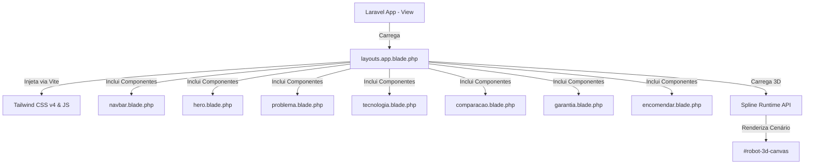

# 🤖 ZettaTech — Documentação Técnica do Sistema e Plataforma

Esta documentação fornece uma visão abrangente e detalhada de toda a arquitetura, design system, componentes, regras de negócios, tecnologias integradas e guias de manutenção da landing page ultra-premium da **ZettaTech**.

---

## 1. Visão Geral da ZettaTech

A **ZettaTech** é uma empresa de ponta no setor de engenharia autônoma e robótica humanoide. Nossa filosofia central baseia-se na criação de assistentes biomecânicos inteligentes projetados sob o conceito de **Human-First Design** (Design Focado em Humanos).

### Objetivos e Filosofia da Empresa

- **Erradicar a Exaustão Humana:** Desenvolver humanoides que assumem fardos pesados, insalubres e repetitivos, liberando a humanidade para focar em criatividade, tomada de decisões e bem-estar.
- **Inovação Adaptativa:** Substituir a programação tradicional de robôs por uma inteligência intuitiva que aprende observando humanos (**Learning by Demonstration**).
- **Segurança Biomecânica:** Atuar sob as mais estritas diretrizes globais de robótica assistiva, assegurando colaboração direta e sem barreiras entre humanos e máquinas.
- **Inclusão Laboral:** Permitir que as plataformas de controle devolvam a autonomia e o potencial de trabalho para pessoas com restrições motoras graves.

---

## 2. Arquitetura Geral do Sistema

O sistema é construído como uma aplicação web moderna de altíssima fidelidade visual, combinando o ecossistema robusto do backend **Laravel** com ferramentas frontend ágeis e bibliotecas de design de ponta.



### Stack Tecnológica e Papéis

1.  **Laravel 12.0 (PHP ^8.2):** Estrutura o esqueleto corporativo, roteamento de páginas e gerenciamento de templates Blade.
2.  **Tailwind CSS v4.0:** Motor utilitário principal para estilização atômica avançada, trazendo maior velocidade de build através da integração nativa com o Vite.
3.  **Vite 7.0:** Gerenciador de assets em tempo real, compilando e injetando modificações instantaneamente no navegador.
4.  **Spline 3D WebGL:** Biblioteca que renderiza o robô humanoide 3D em tempo real de forma fluida no canvas.
5.  **VanillaTilt.js:** Efeito físico de giroscópio e inclinação 3D nos cartões de problemas e plataformas industriais.
6.  **AOS.js (Animate On Scroll):** Core de micro-animações ativadas à medida que o usuário rola a página.

---

## 3. Mapeamento de Componentes e Funções

O site está modularizado para facilitar a manutenção. Abaixo, veja a localização exata de cada componente do sistema e sua função:

| Seção Visual     | Caminho do Arquivo no Workspace                   | Elementos e Funcionalidades Principais                                                                                                                                                                                              |
| :--------------- | :------------------------------------------------ | :---------------------------------------------------------------------------------------------------------------------------------------------------------------------------------------------------------------------------------- |
| **Página Raiz**  | `resources/views/home.blade.php`                  | Ponto de entrada do frontend. Estende o layout global e renderiza ordenadamente todas as seções Blade.                                                                                                                              |
| **Shell/Layout** | `resources/views/layouts/app.blade.php`           | Contém a tag `<head>`, estilos globais, lógica JavaScript do cursor neon, lógica de tradução PT/EN, lógica de transição de Temas (Sol/Lua) e a inicialização do Canvas Spline 3D.                                                   |
| **Navbar**       | `resources/views/components/navbar.blade.php`     | Navbar flutuante com efeito Glassmorphic, logotipo da ZettaTech, seletores táteis de idioma (PT/EN) e tema (Sol/Lua), botão de CTA, menu mobile responsivo colapsável e mecanismo dinâmico de realce ativo de scroll (_ScrollSpy_). |
| **Hero**         | `resources/views/components/hero.blade.php`       | Banner inicial com o Badge de Engenharia, título de alto impacto visual com degradê, caixa descritiva premium, botões de chamada para ação rápidos e painel de estatísticas futuristas (Autonomia, Latência, LbD).                  |
| **Problema**     | `resources/views/components/problema.blade.php`   | Apresenta "A Dor que Resolvemos". Contém cartões interativos em 3D (Esgotamento Crônico, Escassez Operacional, Sobrecarga Doméstica/Agro) com efeitos táteis dinâmicos.                                                             |
| **Tecnologia**   | `resources/views/components/tecnologia.blade.php` | Demonstração técnica da inteligência central (_Learning by Demonstration_). Contém duas colunas estruturais detalhando Síntese Visual e Mapeamento Neural.                                                                          |
| **Plataformas**  | `resources/views/components/comparacao.blade.php` | Seção de comparação física e comercial dos humanoides. Possui o **Modo Blueprint** (esquema técnico de engenharia) e o **Scanner a Laser Interativo** que revela as capacidades práticas de cada robô no hover.                     |
| **Compromisso**  | `resources/views/components/garantia.blade.php`   | Painel de sinais de confiança (_Trust Signals_), destacando segurança assistiva ISO 13482, criptografia de dados e o badge de certificação ergonômica e ética global.                                                               |
| **Reserva**      | `resources/views/components/encomendar.blade.php` | Formulário de reserva sem custos, permitindo escolher a plataforma de interesse e preencher dados cadastrais no estilo clean premium.                                                                                               |

---

## 4. Detalhes das Plataformas (Robôs)

A ZettaTech possui duas frentes tecnológicas principais focadas em otimização de trabalho:

### 🏭 Zetta Atlas (Segmento Industrial B2B)

- **Foco:** Logística pesada, manufatura de precisão, rondas de vigilância noturna e operação sob condições inóspitas 24/7.
- **Chassi:** Armadura blindada em **Titânio Fosco**.
- **Conectividade:** Integrado diretamente com o **ZettaHub API**, sincronizando instantaneamente com sistemas ERP empresariais, controladores de frotas e centrais de dados de segurança.
- **Especificações:** Altura de **1.95m** | Carga Máxima Suportada de **85kg**.
- **Comercialização:** Compra Direta por **R$ 1,2 Milhões** ou no modelo RaaS (Robot-as-a-Service) por **R$ 22.500/mês**.

### 🏡 Zetta Gaia (Segmento Doméstico e Agrícola B2C)

- **Foco:** Assistência no lar, cuidados especiais, manutenção e agricultura familiar ecológica de alta precisão.
- **Chassi:** Revestimento ergonômico em **Polímero Branco de alta resistência**.
- **Conectividade:** Ecossistemas inteligentes (**Apple HomeKit / Google Home**) e pelo aplicativo proprietário **Zetta Care**, permitindo configurar rotinas de jardim, horta e limpeza.
- **Especificações:** Altura de **1.75m** | Carga Máxima Suportada de **35kg**.
- **Comercialização:** Compra parcelada por **R$ 675.000** ou assinatura mensal do pacote Care & Farm por **R$ 4.250/mês**.

---

## 5. Inteligência Artificial Core

Os humanoides ZettaTech se diferenciam pelo uso de três tecnologias fundamentais:

```
[Visão Estereoscópica + LiDAR] ──> Síntese Visual Volumétrica 3D em Tempo Real
                                                 │
                                                 ▼
[Observação de Gestos Humanos]  ──> Learning by Demonstration (LBD)
                                                 │
                                                 ▼
[Comando Cinemático Contínuo]   ──> Mapeamento Neural de Torque & Rotação
```

1.  **Learning by Demonstration (LbD):** A inteligência artificial elimina a programação em linha de código. O robô observa o movimento executado pelo operador humano uma única vez e replica os gestos biomecânicos autonomamente.
2.  **Síntese Visual Volumétrica:** Sensores ópticos estereoscópicos e LiDAR de alta resolução geram um modelo volumétrico tridimensional em tempo real. O robô analisa o ambiente a nível milimétrico, prevendo colisões com objetos em movimento instantaneamente.
3.  **Mapeamento Neural Proprietário:** Uma rede neural profunda traduz o fluxo óptico dos movimentos humanos diretamente em coeficientes de torque de rotação dos atuadores físicos. Isso dá ao humanoide uma sutileza ímpar, capaz de manusear objetos frágeis ou aplicar força de forma segura.

---

## 6. Sistema de Estilização e Temas

A landing page utiliza um ecossistema avançado de CSS. A estilização combina **Tailwind CSS v4.0** com regras sob medida integradas ao layout principal para oferecer transições fluidas e contrastes refinados.

### A. Estrutura do Tailwind CSS v4.0

O projeto adota a nova versão v4.0 do Tailwind, o que elimina a necessidade do antigo arquivo `tailwind.config.js`. A configuração de fontes e escaneamento é feita diretamente no arquivo de estilos central:

- **Arquivo de Entrada:** `resources/css/app.css`
- **Directiva central:** `@import "tailwindcss";` importa os arquivos base.
- **Directiva `@source`:** Indica quais pastas o compilador Tailwind deve escanear para extrair as classes dinâmicas, incluindo views blade e arquivos JS.
- **Directiva `@theme`:** Define variáveis globais, como a fonte padrão sans-serif (`--font-sans`).

### B. Modo Escuro e Claro Dinâmico (Tema Sol/Lua)

- **Lógica:** O site carrega no **Modo Escuro (Dark Mode)** por padrão. Quando o usuário clica no botão de tema, a função JavaScript `toggleTheme()` adiciona ou remove a classe `.light-mode` da tag `<body>`.
- **Estilos Customizados:** Na tag `<style>` dentro de `layouts/app.blade.php` (linhas 57-316), existem modificadores com o prefixo `body.light-mode`. Quando o corpo recebe essa classe, ela substitui os gradientes escuros por fundos claros premium no estilo macOS/iOS (`#F5F5F7` e `#FAFAFC`), alterando cores de bordas, opacidades de vidro e cores de texto simultaneamente.
- **Filtro do Robô 3D no Modo Claro:** Para garantir que o robô Spline 3D apareça perfeitamente cromado em fundo claro (sem perder nitidez), o canvas recebe um filtro de cor revolucionário no Modo Claro:
    ```css
    body.light-mode #robot-3d-canvas {
        filter: invert(0.94) hue-rotate(180deg) brightness(1.02) contrast(1.25)
            opacity(0.85) !important;
    }
    ```

### C. Modo Blueprint Técnico

- **Ativação:** Localizado no componente de comparação, o botão "Modo Blueprint" ativa a classe `.blueprint-mode` no contêiner dos robôs.
- **Efeito Visual:** O design das plataformas é transformado em um esquema técnico militar de engenharia cibernética. Os humanoides ganham filtros de cor ciano néon translúcidos, as imagens de fundo e laser são desligadas, e o fundo cinza escuro ganha um padrão de grade milimétrica desenhado diretamente com gradientes de linha CSS:
    ```css
    .blueprint-mode .scanner-card {
        border-color: rgba(0, 229, 255, 0.4) !important;
        background-color: #06080d !important;
        background-image:
            linear-gradient(to bottom, rgba(0, 229, 255, 0.02), transparent),
            linear-gradient(rgba(0, 229, 255, 0.03) 1px, transparent 1px),
            linear-gradient(90deg, rgba(0, 229, 255, 0.03) 1px, transparent 1px) !important;
        background-size:
            100% 100%,
            24px 24px,
            24px 24px !important;
    }
    ```

### D. Efeito Laser Scanner

- **Hover Interativo:** Passar o mouse nos cartões de robôs aciona uma animação de escaneamento a laser de alta tecnologia.
- **Funcionamento:** Uma linha horizontal néon (`.scanner-line`) com sombra de neon desliza do topo até a base. Simultaneamente, um efeito de máscara (`clip-path: inset()`) revela de forma suave a imagem do robô em ação e em cores vivas por cima do modelo técnico estático:
    ```css
    .scanner-card .acao-img {
        clip-path: inset(0 0 100% 0);
        transition: clip-path 0.9s cubic-bezier(0.4, 0, 0.2, 1);
    }
    .scanner-card:hover .acao-img {
        clip-path: inset(0 0 0 0);
    }
    ```

---

## 7. Bibliotecas e Dependências

Todas as dependências foram integradas respeitando as melhores práticas de performance. Estão devidamente instaladas e validadas tanto via gerenciador de pacotes local quanto por CDNs premium estáveis.

### A. Dependências de Desenvolvimento locais (`package.json`)

- **`tailwindcss` (^4.0.0):** Compilador do Tailwind CSS v4 para estilização ágil.
- **`@tailwindcss/vite` (^4.0.0):** Plugin oficial para compilar o Tailwind de forma ultra-rápida de forma nativa no pipeline do Vite.
- **`vite` (^7.0.7):** Servidor de desenvolvimento rápido e bundler de produção.
- **`laravel-vite-plugin` (^2.0.0):** Faz a ponte oficial entre o ecossistema Laravel e o Vite.
- **`concurrently` (^9.0.1):** Permite rodar o servidor backend PHP Artisan e o servidor de build do Vite simultaneamente com um único comando.

### B. Integrações de Script CDNs (Layout Principal)

- **Spline Runtime API (`unpkg.com/@splinetool/runtime`):** Gerencia o download e o controle interativo tridimensional do robô hospedado na nuvem oficial da Spline Design.
- **AOS (Animate On Scroll) (`unpkg.com/aos`):** Sistema leve de revelação de blocos com animações dinâmicas de rolagem.
- **VanillaTilt (`vanilla-tilt.min.js`):** Garante a física tridimensional de inclinação de perspectiva nos cartões ao toque do mouse.

---

## 8. Guia de Manutenção e Alterações Práticas

Deseja realizar modificações no futuro? Siga as receitas rápidas abaixo para fazer a manutenção do sistema com segurança:

### 🎨 Como alterar cores ou estilos globais?

1.  **Tailwind Utility:** Para pequenas alterações nos componentes, utilize as próprias classes utilitárias do Tailwind diretamente nas tags HTML dos componentes em `resources/views/components/`.
2.  **Cores de Fundo e Customizações Complexas:** Abra o layout em `resources/views/layouts/app.blade.php`. Navegue até a tag `<style>` (a partir da linha 16) e altere as variáveis CSS do corpo, da barra de rolagem ou as classes com prefixo `body.light-mode` se deseja alterar o comportamento do Modo Claro.
3.  **Configurações Atômicas:** Se quiser adicionar fontes extras ou alterar o tema base do Tailwind, edite a tag `@theme` em `resources/css/app.css`.

### 📝 Como alterar textos e traduções PT/EN?

A tradução do site é realizada em tempo real no cliente para evitar recargas e latências de rede.

1.  Abra o layout principal em `resources/views/layouts/app.blade.php`.
2.  Procure a constante `translations` na tag `<script>` (linha 371).
3.  Você encontrará dois blocos principais: `pt` (Português) e `en` (Inglês).
4.  Cada texto possui uma chave (ex: `hero-title`). Altere o valor correspondente nessa chave para atualizar o texto na tela.
5.  **Adicionar novo texto dinâmico:** Crie a chave e seu valor correspondente nos blocos `pt` e `en`. Depois, no HTML do seu componente, basta adicionar o atributo `data-translate="nome-da-sua-chave"` na tag desejada.

### 🤖 Como atualizar ou trocar o modelo 3D do Robô?

Nossa equipe modelou o robô no **Spline**. Se desejar trocar a cena 3D:

1.  Crie ou modifique um modelo na plataforma [Spline Design](https://spline.design/).
2.  Exporte o link público no formato **Spline Viewer** (geralmente gerado como `https://prod.spline.design/xxxxxx/scene.splinecode`).
3.  Abra `resources/views/layouts/app.blade.php` e vá até a linha 656.
4.  Substitua a URL antiga no método `app.load('SUA_NOVA_URL')` e salve o arquivo.

---

## 9. Guia Definitivo do `.gitignore`

Para garantir que o repositório no GitHub permaneça leve, seguro e sem arquivos que possam expor chaves confidenciais da sua aplicação, configuramos um arquivo `.gitignore` otimizado na raiz do projeto.

### O que NÃO deve ser enviado ao GitHub (E por quê?)

1.  **`.env`:** Arquivo contendo dados de conexão de banco de dados locais, senhas, chaves criptográficas (`APP_KEY`) e dados de produção. **NUNCA** suba este arquivo para o GitHub, pois expõe o sistema a invasões de segurança.
2.  **`node_modules/`:** Pasta que contém milhares de arquivos das dependências baixadas do Node.js. Ocupa centenas de megabytes. Pode ser facilmente gerada novamente em qualquer máquina rodando `npm install`.
3.  **`vendor/`:** Pasta contendo os pacotes baixados pelo PHP Composer. Segue o mesmo princípio do `node_modules` e pode ser reconstruída rodando `composer install`.
4.  **`public/build` e `public/hot`:** Arquivos e bundles compilados gerados automaticamente pelo Vite no build de produção. Não devem ser versionados porque mudam a cada build.
5.  **`*.log`:** Arquivos de logs de depuração (erros de execução) criados dinamicamente pelo Laravel e PHP.
6.  **Pastas de IDEs (`/.vscode`, `/.idea`):** Arquivos de configurações internas de editores de código dos desenvolvedores.

### Conteúdo Completo Otimizado para o seu `.gitignore`

Copie e cole o bloco a seguir no arquivo `.gitignore` localizado na raiz do seu projeto humanoide:

```text
# Cache, Logs e Temporários
*.log
.DS_Store
Thumbs.db
.phpunit.result.cache
/.phpunit.cache

# Configurações confidenciais e Backups (Crítico para Segurança!)
.env
.env.backup
.env.production
/auth.json
/storage/*.key

# Dependências locais de pacotes (Evita repositórios pesados)
/node_modules
/vendor

# Compilados de Frontend (Gerados automaticamente pelo Vite)
/public/build
/public/hot
/public/storage

# Configurações de IDEs e Editores
/.vscode
/.idea
/.fleet
/.nova
/.zed
.phpactor.json

# Vagrant / Homestead
Homestead.json
Homestead.yaml
/storage/pail
```

---

## 10. Como Rodar e Configurar o Projeto do Zero

Se você ou outro desenvolvedor clonar o projeto em uma nova máquina, execute os seguintes passos no terminal para subir o sistema instantaneamente:

### Passo 1: Instalar dependências de Backend e Frontend

```powershell
# Instala os pacotes do PHP Laravel
composer install

# Instala os pacotes do Tailwind CSS, Vite e JS
# e gera automaticamente o build dos assets para o Laravel
npm install
```

### Passo 2: Configurar o arquivo de variáveis de ambiente

Se você estiver usando PowerShell ou Prompt de Comando no Windows:

```powershell
# Copia o modelo de variáveis de ambiente padrão
copy .env.example .env

# Gera a chave criptográfica segura da aplicação Laravel
php artisan key:generate
```

Se você estiver usando Git Bash, WSL, macOS ou Linux:

```bash
# Copia o modelo de variáveis de ambiente padrão
cp .env.example .env

# Gera a chave criptográfica segura da aplicação Laravel
php artisan key:generate
```

### Passo 3: Executar o Servidor Integrado ZettaTech

Graças à automação que configuramos com o comando `npm run dev` e o script `setup` no `composer.json`, você pode iniciar todos os servidores (Vite, Artisan Serve, logs e filas de execução) em paralelo com um único comando tátil:

```powershell
# Inicia todos os serviços necessários em paralelo de forma mágica!
npm run dev
```

Abra o seu navegador no endereço fornecido pelo painel do Artisan (geralmente `http://127.0.0.1:8000`) e sinta a experiência de alto nível da plataforma ZettaTech!

---

> [!NOTE]
> Esta documentação foi cuidadosamente desenhada para servir como a "fonte única da verdade" técnica da ZettaTech, garantindo que qualquer futura manutenção no design system, nas lógicas corporativas ou nas integrações seja direta, intuitiva e sem atrito.
